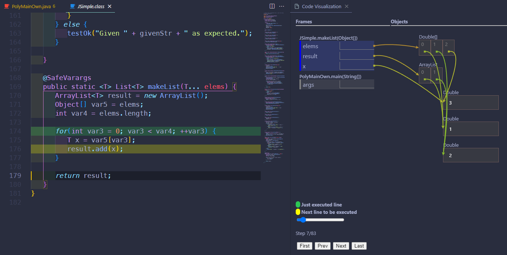
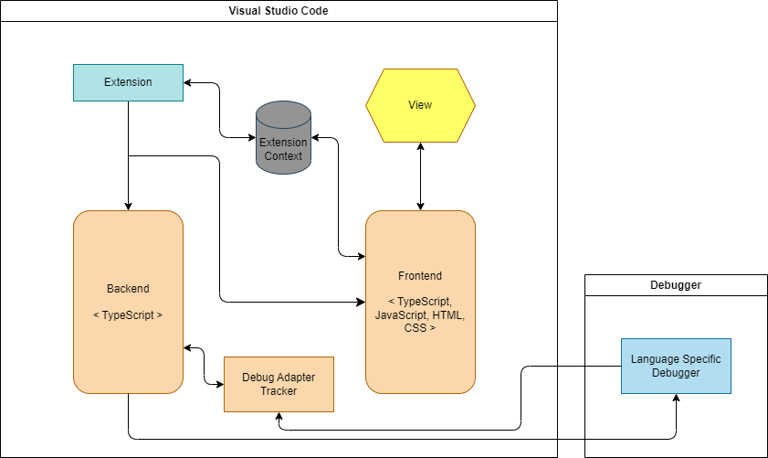
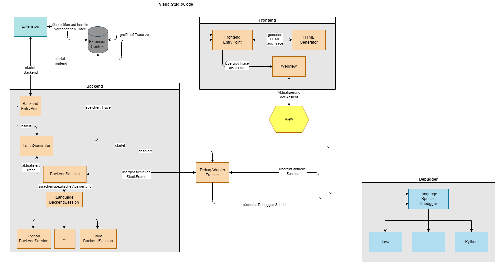

# ProgramFlow-Visualization

This extension helps to visualize programs and is meant to support beginners in programming. The extension is inspired by [Python Tutor](https://pythontutor.com/).

## Features

The extension is used to visualise a program and its heap and stack. Currently there is support for Java and Python. An example is shown in the image below.



To start the visualisation it is necessary to have the file open and it is a normal `.py` or `.java` file. Then a button `programflow-visualisation` will appear in the context menu or in the run field to start it.

## Requirements

It is necessary to have the correct extension in vsc for the specific language.

For example, for Java it is recommended to have [Debugger for Java](https://marketplace.visualstudio.com/items?itemName=vscjava.vscode-java-debug) and also [Language Support for Java(TM) by Red Hat](https://marketplace.visualstudio.com/items?itemName=redhat.java) installed.

For Python, [Python](https://marketplace.visualstudio.com/items?itemName=ms-python.python) and [Jupyter](https://marketplace.visualstudio.com/items?itemName=ms-toolsai.jupyter).

## Architecture 

### Simple Architecture




### Detailed Architecture



## Troubleshooting

If an error occurs, it may be because the extension needs to create a file. So a fix might be to make sure you have the correct permissions on the folder.

```bash
sudo chown -R <my_username> <my_folder>
```

## Extension Settings

This extension adds the following settings:

* `Output Backend Trace`: enable/disable the output of the generated trace to a json file.

## Known Issues

* Some visualisations, such as a HashMap in Java, are not as perfect as they should be.

* With larger files it becomes very slow and inefficient.

## Release Notes

The release notes are listed below
### 1.0.0

Initial release of ProgramFlow-Visualisation.

* Support for Python and Java
